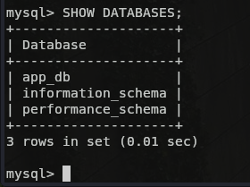

# Інструкція для запуску ToDo App з MySQL (з Volume)

## 🔧 Необхідні умови

- Docker
- Docker Compose (опційно, якщо ти його використовуєш)
- Git

---

##  Як запустити проєкт

### 1. Клонуй репозиторій:
```bash
git clone https://github.com/YOUR_USERNAME/devops_todolist_docker_core_task_2_volumes.git
cd devops_todolist_docker_core_t# Django TODO App with MySQL

## Run MySQL with Volume
```bash
docker run -dask_2_volumes --name mysql-container -p 3306:3306 -v mysql_data:/var/lib/mysql mysql-local:1.0.0
